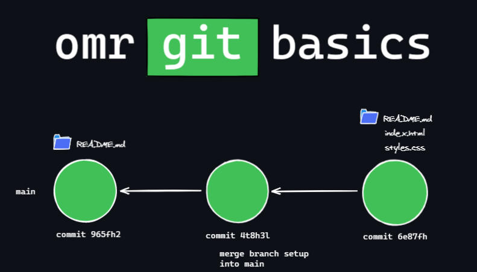

# omr-git-basics

A collection of resources to learn git

# What is git?

> Git is a distributed version-control system for tracking changes in any set of files, originally designed for coordinating work among programmers cooperating on source code during software development.

A system for version control. A collection of snapshots of your project over time.

# What this repository is for

We would like to demistify `git` a little bit, so it is less magical, but more concrete for you what it actually does. We will talk about:

- [Visualise](http://git-school.github.io/visualizing-git/) what a series of commits looks like
- The difference between ["local" and "remote"](https://stackoverflow.com/a/16408515/15098171)
- What happens if you ["checkout"](https://www.atlassian.com/git/tutorials/using-branches/git-checkout) a branch or commit `git checkout`
- What is ["staging"](https://dev.to/sublimegeek/git-staging-area-explained-like-im-five-1anh) or the "stage"
- What are merge conflicts and how to resolve them

# Resources

http://git-school.github.io/visualizing-git/
https://stackoverflow.com/a/16408515/15098171
https://www.atlassian.com/git/tutorials/using-branches/git-checkout
https://dev.to/sublimegeek/git-staging-area-explained-like-im-five-1anh

https://matthew-brett.github.io/curious-git/index.html
https://learngitbranching.js.org/
https://try.github.io/
https://thoughtbot.com/blog/git-interactive-rebase-squash-amend-rewriting-history
https://dev.to/unseenwizzard/learn-git-concepts-not-commands-4gjc
